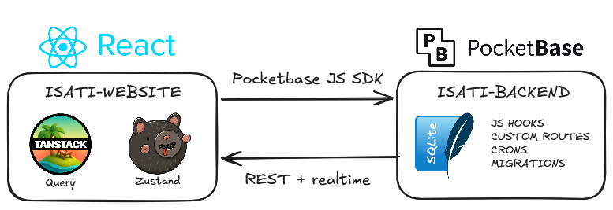

<a id="readme-top"></a>

[![React][React.js]][React-url]
[![TypeScript][TypeScript]][TypeScript-url]
[![PocketBase][PocketBase]][PocketBase-url]
[![Team][team-shield]](#team)
[![Year][year-shield]](../../README.md#esir-2)
[![Live][live-shield]][live-url]


<br />
<div align="center">
  <a href="https://www.isati.org">
    
  </a>

  <h3 align="center">ISATI Website</h3>

  <p align="center">
    A full rewrite of the website of ISATI, the student association (BDE) of ESIR, built with React, TypeScript and PocketBase, which I led as the association's CTO.
    <br />
    Association project, 2nd year of the ESIR engineering cycle (ESIR 2).
    <br />
    <br />
    <a href="https://www.isati.org">Visit the Website</a>
    &middot;
    <a href="https://github.com/BDE-ISATI/isati-website">Frontend Repo</a>
    &middot;
    <a href="https://github.com/BDE-ISATI/isati-backend">Backend Repo</a>
    &middot;
    <a href="../../README.md">Back to Portfolio</a>
  </p>
</div>

> [!NOTE]
> The source code is not copied into this portfolio: it lives in the two public repositories of the BDE-ISATI organization, [isati-website](https://github.com/BDE-ISATI/isati-website) (frontend) and [isati-backend](https://github.com/BDE-ISATI/isati-backend) (backend). This page presents the project as a whole and my contribution to it.


<details>
  <summary>Table of Contents</summary>
  <ol>
    <li>
      <a href="#about-the-project">About the Project</a>
      <ul>
        <li><a href="#impact">Impact</a></li>
        <li><a href="#built-with">Built With</a></li>
      </ul>
    </li>
    <li><a href="#features">Features</a></li>
    <li><a href="#technical-overview">Technical Overview</a></li>
    <li><a href="#getting-started">Getting Started</a></li>
    <li><a href="#team">Team</a></li>
    <li><a href="#what-i-learned">What I Learned</a></li>
    <li><a href="#roadmap">Roadmap</a></li>
    <li><a href="#license">License</a></li>
    <li><a href="#acknowledgments">Acknowledgments</a></li>
  </ol>
</details>


## About the Project

<div align="center">
  
</div>

<br />

**ISATI** is the student association (BDE) of [ESIR][esir-url]. Its previous website had been abandoned for a long time and was no longer maintained. When I became the association's **CTO**, I decided to rebuild it from scratch, with two goals:

* **Accessibility:** a modern, responsive website that every student can use comfortably, on a phone as well as on a computer.
* **Sustainability:** give the next committees real tools to create and run events on their own, without having to tinker with the code or the database every year.

The project is split into a **React single-page application** and a **PocketBase backend** in which all business rules and permissions are enforced server-side. The first big feature shipped is a complete platform for the **WEI** (the school's integration weekend): teams, challenges, photo/video validations and live leaderboards.

This project is part of my **VEE** (*Valorisation de l'Engagement Étudiant*), the ESIR program that recognizes student involvement in associations as an alternative to the sports course.

### Impact

The website was used in production for the 2026 WEI:

| Registered users | WEI challenge participants | Photo / video validations |
| :--------------: | :------------------------: | :-----------------------: |
| **134**          | **124**                    | **481**                   |

<p align="right">(<a href="#readme-top">back to top</a>)</p>

### Built With

**Frontend**

* [![React][React.js]][React-url]
* [![TypeScript][TypeScript]][TypeScript-url]
* [![Vite][Vite]][Vite-url]
* [![TailwindCSS][Tailwind]][Tailwind-url]
* [![TanStack Query][TanStack]][TanStack-url]

**Backend**

* [![PocketBase][PocketBase]][PocketBase-url]
* [![JavaScript][JavaScript]][JavaScript-url]
* [![SQLite][SQLite]][SQLite-url]

<p align="right">(<a href="#readme-top">back to top</a>)</p>


## Features

**Accounts**
* Sign up, login, email verification and password reset (with HTML email templates)
* Onboarding page for new users
* Profile page with avatar upload and in-browser image cropping, and account deletion
* Roles and permissions stored in the database and checked server-side; the frontend adapts its navigation to the user's permissions

**WEI challenge platform**
* Creation of a WEI and of its challenges, organized in categories, with optional locations
* Teams and factions, with individual and team-scoped challenges
* Challenge validation by uploading a photo or a video, **compressed in the browser** before upload to save bandwidth and storage
* Validation review by the organizers, with archiving and secured access rules
* Team and individual leaderboards (team challenges are not counted in individual scores)
* Separate student and organizer panels, and individual pages for each participant

<div align="center">
  
  <br />
  <em>WEI challenges, grouped by category.</em>
  <br />
  <br />
  
  <br />
  <em>Validating a challenge with a photo or a video.</em>
  <br />
  <br />
  
  <br />
  <em>Team leaderboard.</em>
</div>

**Other**
* Room availability, synchronized periodically by a scheduled job
* Navigation links managed from the database
* Legal notice and privacy policy pages
* Fully responsive layout

<p align="right">(<a href="#readme-top">back to top</a>)</p>


## Technical Overview

<div align="center">
  <picture>
    <source media="(prefers-color-scheme: dark)" srcset="images/technical-overview-dark-background.excalidraw.png">
    
  </picture>
</div>

**Frontend.** The code is organized **by feature** (`auth`, `profile`, `roles`, `navLinks`, `wei`), each with its own components, hooks and types, while everything reused across features lives in `shared/`. Server state is handled with **TanStack Query** (caching, invalidation, typed errors), client state such as the authenticated user and their permissions with **Zustand**, and forms with **react-hook-form**.

```
src/
├── features/     auth, navLinks, profile, roles, wei
├── pages/        Auth, Home, Legal, Profile, Wei, NotFound
└── shared/       components, hooks, types, utils
    └── lib/      PocketBase client, query client, error handling,
                  date helpers, image cropping, video compression
```

**Backend.** PocketBase provides authentication, the database (SQLite), file storage and an auto-generated REST API. Everything the API alone can't guarantee is written as **JavaScript hooks**: one file per collection (`challenges`, `validations`, `teams`, `weis`, `participations`…), custom routes, scheduled jobs (room synchronization, WEI leader role cleanup) and shared helpers for permissions and emails. The schema is versioned through **migrations**.

```
pb_hooks/         One hook file per collection, custom routes, crons
├── utils/        Permissions, mail, rooms, WEI helpers
└── views/        Email HTML templates
pb_migrations/    Schema migrations
```

**End-to-end typing.** The frontend TypeScript types are **generated from the PocketBase database** (`npm run types`), so the SDK returns typed records and any schema change is caught at compile time instead of in production.

<p align="right">(<a href="#readme-top">back to top</a>)</p>


## Getting Started

A short overview; the full instructions are in the READMEs of [isati-website](https://github.com/BDE-ISATI/isati-website#getting-started) and [isati-backend](https://github.com/BDE-ISATI/isati-backend#getting-started).

1. Clone both repositories side by side
   ```sh
   git clone https://github.com/BDE-ISATI/isati-backend.git
   git clone https://github.com/BDE-ISATI/isati-website.git
   ```
2. Download the [PocketBase](https://github.com/pocketbase/pocketbase/releases) 0.39.x binary into `isati-backend/`, then start it (migrations are applied automatically)
   ```sh
   cd isati-backend
   ./pocketbase serve
   ```
3. In `isati-website/`, create a `.env` file
   ```env
   VITE_PB_URL=http://127.0.0.1:8090
   VITE_ALLOW_TEST_EMAILS=false
   ```
4. Install the dependencies and start the frontend (Node.js 24+)
   ```sh
   npm install
   npm run dev
   ```

<p align="right">(<a href="#readme-top">back to top</a>)</p>


## Team

| Member                                                                 | Role / Main contributions                                                                                                                                                   |
| ---------------------------------------------------------------------- | --------------------------------------------------------------------------------------------------------------------------------------------------------------------------- |
| **Victor Dessaigne** ([@CraftCruiser](https://github.com/CraftCruiser)) | CTO of the association, lead full-stack developer: React rewrite and architecture, accounts and profile, roles and permissions, the whole WEI platform (frontend and backend hooks), validation security, documentation |
| [@Timote-Godard](https://github.com/Timote-Godard)                     | Room availability system, home page                                                                                                                                         |

<p align="right">(<a href="#readme-top">back to top</a>)</p>


## What I Learned

* Running a real project for real users: shipping a feature before a fixed deadline (the WEI) and supporting more than a hundred students using it at the same time
* Structuring a React + TypeScript codebase by feature so that it stays maintainable for the next committees
* Separating server state (TanStack Query) from client state (Zustand), and handling API errors in a typed, consistent way
* Using a Backend-as-a-Service (PocketBase) while keeping business rules and **security on the server**: access rules, hooks and custom routes, and fixing permission flaws on user uploads
* Versioning a database schema with migrations, and generating frontend types from it
* Processing media in the browser (video compression, image cropping) to reduce upload size and server storage
* Working with branches and pull requests in a GitHub organization, and writing documentation for future contributors

<p align="right">(<a href="#readme-top">back to top</a>)</p>


## License

Both repositories are distributed under the **GNU Affero General Public License v3**. See the `LICENSE` file of [isati-website](https://github.com/BDE-ISATI/isati-website/blob/main/LICENSE) and [isati-backend](https://github.com/BDE-ISATI/isati-backend/blob/main/LICENSE).

<p align="right">(<a href="#readme-top">back to top</a>)</p>


## Acknowledgments

* [ISATI](https://www.isati.org), the student association of ESIR
* [ESIR, University of Rennes][esir-url]
* [PocketBase](https://pocketbase.io/) and its documentation
* [Best-README-Template](https://github.com/othneildrew/Best-README-Template)
* [Shields.io](https://shields.io)

<p align="right">(<a href="#readme-top">back to top</a>)</p>


[team-shield]: https://img.shields.io/badge/Team-2%20students-555?style=for-the-badge
[year-shield]: https://img.shields.io/badge/ESIR-ESIR%202-005F9E?style=for-the-badge
[live-shield]: https://img.shields.io/badge/Live-isati.org-2EA44F?style=for-the-badge
[live-url]: https://www.isati.org
[esir-url]: https://esir.univ-rennes.fr/
[React.js]: https://img.shields.io/badge/React-20232A?style=for-the-badge&logo=react&logoColor=61DAFB
[React-url]: https://react.dev/
[TypeScript]: https://img.shields.io/badge/TypeScript-3178C6?style=for-the-badge&logo=typescript&logoColor=white
[TypeScript-url]: https://www.typescriptlang.org/
[Vite]: https://img.shields.io/badge/Vite-646CFF?style=for-the-badge&logo=vite&logoColor=white
[Vite-url]: https://vite.dev/
[Tailwind]: https://img.shields.io/badge/Tailwind_CSS-38B2AC?style=for-the-badge&logo=tailwind-css&logoColor=white
[Tailwind-url]: https://tailwindcss.com/
[TanStack]: https://img.shields.io/badge/TanStack_Query-FF4154?style=for-the-badge&logo=reactquery&logoColor=white
[TanStack-url]: https://tanstack.com/query/latest
[PocketBase]: https://img.shields.io/badge/PocketBase-B8DBE4?style=for-the-badge&logo=pocketbase&logoColor=black
[PocketBase-url]: https://pocketbase.io/
[JavaScript]: https://img.shields.io/badge/JavaScript-F7DF1E?style=for-the-badge&logo=javascript&logoColor=black
[JavaScript-url]: https://developer.mozilla.org/docs/Web/JavaScript
[SQLite]: https://img.shields.io/badge/SQLite-003B57?style=for-the-badge&logo=sqlite&logoColor=white
[SQLite-url]: https://www.sqlite.org/
