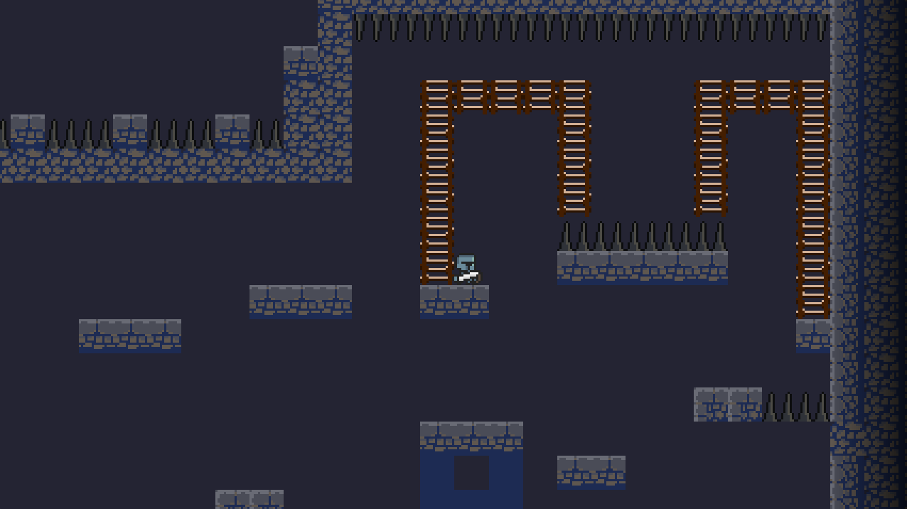
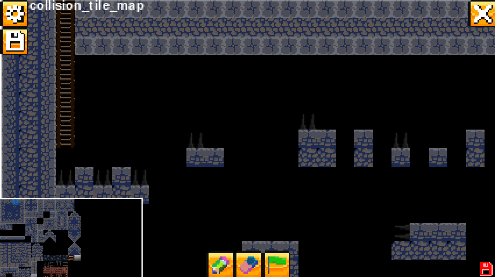

<a id="readme-top"></a>

[![Python][Python]][Python-url]
[![Pygame][Pygame]][Pygame-url]
[![Team][team-shield]](#team)
[![Year][year-shield]](../../README.md#prépa-2)


<br />
<div align="center">
  

  <h3 align="center">Knight Tower</h3>

  <p align="center">
    A 2D pixel-art platformer written in Python with Pygame, where a knight has to climb a tower as fast as possible, plus a built-in level editor.
    <br />
    Team project, 2nd year of the ESIR integrated preparatory cycle (Prépa 2).
    <br />
    <br />
    <a href="#getting-started">Run the Game</a>
    &middot;
    <a href="#features">See Features</a>
    &middot;
    <a href="../../README.md">Back to Portfolio</a>
  </p>
</div>


<details>
  <summary>Table of Contents</summary>
  <ol>
    <li>
      <a href="#about-the-project">About the Project</a>
      <ul>
        <li><a href="#gameplay">Gameplay</a></li>
        <li><a href="#built-with">Built With</a></li>
      </ul>
    </li>
    <li><a href="#features">Features</a></li>
    <li>
      <a href="#getting-started">Getting Started</a>
      <ul>
        <li><a href="#prerequisites">Prerequisites</a></li>
        <li><a href="#installation">Installation</a></li>
        <li><a href="#configuration">Configuration</a></li>
      </ul>
    </li>
    <li><a href="#controls">Controls</a></li>
    <li><a href="#technical-overview">Technical Overview</a></li>
    <li><a href="#team">Team</a></li>
    <li><a href="#what-i-learned">What I Learned</a></li>
    <li><a href="#roadmap">Roadmap</a></li>
    <li><a href="#acknowledgments">Acknowledgments</a></li>
  </ol>
</details>


## About the Project

<div align="center">
  
</div>

<br />

**Knight Tower** is a vertical platformer: the goal is to reach the top of a tower in the shortest time possible. The catch is that a single missed jump can send you falling a long way back down, so every move counts.

The project was carried out by a team of four students during the second year of the integrated preparatory cycle at [ESIR][esir-url]. Beyond the game itself, we built a full **level editor** so that players can create, edit and play their own maps.

### Gameplay

1. **Intro sequence:** the game opens on a dark room. Once you press *Jouer*, the menu fades away and you take control of the knight, who has to climb a ladder towards the light coming from a trapdoor.
2. **The climb:** as soon as you come out of the trapdoor, the timer starts. Run, jump, dash and climb ladders to make your way up the tower while avoiding spikes.
3. **The finish:** the run ends when you reach the top of the map, and your final time is displayed.

Falling out of the map or touching a spike kills the knight: a death animation plays, the camera travels back to the spawn point and you start over.

<p align="right">(<a href="#readme-top">back to top</a>)</p>

### Built With

* [![Python][Python]][Python-url]
* [![Pygame][Pygame]][Pygame-url]

<p align="right">(<a href="#readme-top">back to top</a>)</p>


## Features

**Game**
* Custom physics: acceleration, ground and air friction, gravity, variable-height jump and an air dash
* Ladders, spikes (killable tiles) and solid tiles, with pixel-perfect collisions using masks
* Smooth camera that follows the player on both axes
* Animated knight (idle, run, jump, climb, death)
* In-game timer, paused while the pause menu is open
* Playable intro sequence that can be skipped on later runs

**Menus**
* Main, pause, options and credits menus with animated buttons (still / hovered / clicked states) and sound effects
* Map selection screen to play any map
* Options saved to `settings.json`: fullscreen, FPS counter, music on/off and volume

**Level editor**
* Create, select and delete maps directly from the menu
* Pen, eraser and spawn-point tools, with a tile picker taken from the map's tileset
* Multi-layer editing (background, collision, spikes, ladders)
* Map resizing (width and height) and map clearing
* Saved / unsaved indicator and `Ctrl + S` shortcut

<div align="center">
  
  <br />
  <em>The level editor: tileset picker (bottom left), current layer (top left) and tools (bottom).</em>
</div>

<p align="right">(<a href="#readme-top">back to top</a>)</p>


## Getting Started

### Prerequisites

* Python 3
* Pygame

```sh
pip install pygame
```

### Installation

1. Clone the portfolio repository
   ```sh
   git clone https://github.com/CraftCruiser/ESIR-projects.git
   ```
2. Go into the project folder (asset paths are relative, so the game must be launched from here)
   ```sh
   cd "ESIR-projects/PREPA2/1 - Projet Jeu Python"
   ```
3. Run the game
   ```sh
   python game.py
   ```

### Configuration

Player settings live in `settings.json` and can also be changed from the in-game options menu:

```json
{
    "display_resolution": [1280, 720],
    "music_volume": 0.1,
    "fullscreen": false,
    "show_fps": false,
    "play_intro": true,
    "play_music": false
}
```

Movement constants (speed, friction, gravity, jump and dash strength, camera smoothness) can be tweaked in `game_config.py`.

<p align="right">(<a href="#readme-top">back to top</a>)</p>


## Controls

The game was designed for an AZERTY keyboard.

### In game

| Key            | Action                     |
| :------------: | -------------------------- |
| `Q` / `D`      | Move left / right          |
| `Z` / `S`      | Climb up / down a ladder   |
| `Space`        | Jump                       |
| `Left Shift`   | Dash (while in the air)    |
| `Esc`          | Pause menu                 |

### In the editor

| Input                 | Action                                  |
| :-------------------: | --------------------------------------- |
| Left click            | Use the current tool                    |
| Right click           | Erase a tile                            |
| Middle click          | Pick the tile under the cursor          |
| Mouse wheel           | Zoom the tileset window                 |
| `1` / `2` / `3`       | Pen / Eraser / Spawn tool               |
| `A` / `E`             | Next / previous layer                   |
| `Ctrl + S`            | Save the map                            |
| `Esc`                 | Back to the menu                        |

<p align="right">(<a href="#readme-top">back to top</a>)</p>


## Technical Overview

The game is built around a simple **state machine**: `game.py` holds the main loop and switches between three states, each with its own events / update / draw / render cycle.

```
game.py               Entry point and main loop (menu / game / editor states)
├── menu_state.py     Main, pause, options, credits and map selection menus
├── game_state.py     Gameplay: camera, death and finish handling, timer
├── editor_state.py   Level editor
├── settings.py       Loads and saves settings.json
├── *_config.py       Constants and textures for each state
└── scripts/
    ├── player.py     Player physics, collisions and animations
    ├── map.py        Map loading, saving, creation, resizing and drawing
    ├── tile.py       Tile sprite
    ├── button.py     Button and ToggleButton sprites
    ├── image.py      Tileset and sprite sheet slicing
    ├── timer.py      Pausable timer
    ├── file.py       JSON / CSV helpers
    └── text.py       Text rendering
```

**Map format.** Each map is a folder in `assets/maps/` containing a `config.json` (size and spawn point), a tileset and one CSV file per layer (`background`, `collision`, `killable`, `ladder`). Each cell stores a tile identifier such as `tileset_6_5`, or `-1` for an empty cell. This makes maps easy to read, version and edit, both by hand and through the editor.

**Rendering.** The game is drawn on a low-resolution surface (about 400 px wide) that is then scaled up to the window size, which keeps the pixel-art look sharp whatever the resolution.

<p align="right">(<a href="#readme-top">back to top</a>)</p>


## Team

| Member              | Role / Main contributions                        |
| ------------------- | ------------------------------------------------ |
| **Victor Dessaigne** | Project lead, camera system                     |
| Timothé Lomet       | Obstacles, in-game timer                         |
| Arthur Faivre       | Main menu and user interface                     |
| Antoine Fischer     | Map design, player movement                      |

<p align="right">(<a href="#readme-top">back to top</a>)</p>


## What I Learned

* Structuring a real-time application around a game loop and a state machine
* Implementing basic 2D physics (velocity, acceleration, friction, gravity) and collision handling
* Designing a simple, editable file format for levels and building a tool on top of it
* Leading a team of four: splitting tasks, keeping a shared to-do list and merging everyone's work with Git

<p align="right">(<a href="#readme-top">back to top</a>)</p>


## Acknowledgments

* [Multi Platformer Tileset](https://shackhal.itch.io/) by **Diego "Shackhal" del Solar** — tilesets, backgrounds and props used for the tower (CC0 license)
* [Pygame](https://www.pygame.org/) and its documentation
* [ESIR, University of Rennes][esir-url]
* [Best-README-Template](https://github.com/othneildrew/Best-README-Template)
* [Shields.io](https://shields.io)

Additional documentation written during the project (how Pygame works and how some game features are implemented): [Google Docs](https://docs.google.com/document/d/1ojhb_Mdf4IByalRCXDDQ34dMWKwSmLRbVj-NXLAdAeY/edit?usp=sharing)

<p align="right">(<a href="#readme-top">back to top</a>)</p>


[Python]: https://img.shields.io/badge/Python-3776AB?style=for-the-badge&logo=python&logoColor=white
[Python-url]: https://www.python.org/
[Pygame]: https://img.shields.io/badge/Pygame-2E8B57?style=for-the-badge&logo=python&logoColor=white
[Pygame-url]: https://www.pygame.org/
[team-shield]: https://img.shields.io/badge/Team-4%20students-555?style=for-the-badge
[year-shield]: https://img.shields.io/badge/ESIR-Prépa%202-005F9E?style=for-the-badge
[esir-url]: https://esir.univ-rennes.fr/
